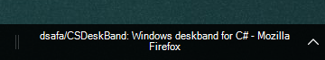
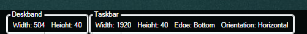

# CS DeskBand
A Library to create [DeskBands](https://msdn.microsoft.com/en-us/library/windows/desktop/cc144099(v=vs.85).aspx) on windows using C#. Deskbands are toolbars that are docked on the taskbar and provide additional functionality to an otherwise unused space.

CSDeskBand makes it easy to create a deskband using Winforms or WPF.

## Screenshots




_Images taken from the sample projects_

## Table of Contents
- [Usage](#usage)
  - [Library Installation](#installation)
  - [Winforms deskband](#winforms)
  - [Wpf deskband](#wpf)
- [Deskband installation](#deskband-installation)
- [Examples](#examples)

## Usage

### Installation
Available as a single file at [output/CSDeskBand.cs](https://github.com/dsafa/CSDeskBand/blob/master/output/CSDeskBand.cs). Copy the file and add to your project.

### Winforms
- Add the compilation symbol `DESKBAND_WINFORMS` to your winforms project.
  - If you want transparency support, you have to also add the symbol `DESKBAND_WPF_TRANSPARENCY`. This is because it requires special operation.
- Add references to `WindowsFormsIntegration.dll`, `System.Windows.Forms` and `System.Drawing`.
- Create a new **public** class that will host your deskband and make it inherit from the abstract class `CSDeskBandWin`. Namespace in `CSDeskBand`
  - Implement the `Control` property to return your main winforms control.
- Add `[ComVisible(true)]`, `[Guid("xx-xx-xx-xx-xx")]`, `[CSDeskBandRegistration()]` attributes to the class.
  - The `CSDeskBandRegistration` attribute allows you to configure:
    - **Name** : The name of the deskband shown in the toolbars menu
    - **ShowDeskBand** : True if the deskband should be shown automatically after registration

```C#
using CSDeskBand.Win;
using CSDeskBand;

[ComVisible(true)]
[Guid("5731FC61-8530-404C-86C1-86CCB8738D06")]
[CSDeskBandRegistration(Name = "Sample Winforms Deskband", ShowDeskBand = True)]
public partial class UserControl1 : CSDeskBandWin
{
    public Deskband()
    {
        Options.MinHorizontalSize = new Size(100, 30);
    }

    protected override Control Control => new UserControl1(); // Returns your main control
}
```

### WPF
- Add the compilation symbol `DESKBAND_WPF` to your wpf project.
- Create a new **public** class that will host your deskband and make it inherit from the abstract class `CSDeskBandWpf`. Namespace in `CSDeskBand`
  - Implement the `UIElement` property to return your main wpf control
- Add `[ComVisible(true)]`, `[Guid("xx-xx-xx-xx-xx")]`, `[CSDeskBandRegistration()]` attributes to the class.
  - The `CSDeskBandRegistration` attribute allows you to configure:
    - **Name** : The name of the deskband shown in the toolbars menu
    - **ShowDeskBand** : True if the deskband should be shown automatically after registration

```cs
    [ComVisible(true)]
    [Guid("AA01ACB3-6CCC-497C-9CE6-9211F2EDFC10")]
    [CSDeskBandRegistration(Name = "Sample wpf")]
    public class Deskband : CSDeskBandWpf
    {
        public Deskband()
        {
            Options.ContextMenuItems = ContextMenuItems;
        }

        protected override UIElement UIElement => new UserControl1(); // Return the main wpf control

        private List<DeskBandMenuItem> ContextMenuItems
        {
            get
            {
                var action = new DeskBandMenuAction("Action");
                return new List<DeskBandMenuItem>() { action };
            }
        }
    }
```

### Both
You can access the `Options` property to change deskband settings such as minimal size or the context menu items available.
Now you are ready to start working on the deskband like a normal user control.

**Check the [Wiki](https://github.com/dsafa/CSDeskBand/wiki) for more details.**
**Patch notes will be in the [release](https://github.com/dsafa/CSDeskBand/releases) page**

## Deskband Installation
You need to start an elevated command prompt and be able to use `regasm.exe`. Make sure that you use the correct version of regasm that matches your platform (x86/x64).
```
cd Sample.Win\bin\Debug

regasm /codebase Sample.Win.dll
```
The `/codebase` switch will add the path of the dll into the registry entry.

Alternatively, register the assemblies into the Global Assembly Cache.
```
gacutil -i CSDeskBand.dll
gacutil -i CSDeskBand.Win.dll
gacutil -i Sample.Win.dll
regasm Sample.Win.dll
```
_Note that GAC installation requires the assemblies to be [Strong-Named](https://docs.microsoft.com/en-us/dotnet/framework/app-domains/strong-named-assemblies)_

Here is an [example .bat file](./tools/install-example.bat) for installing a deskband.

## Examples
There are example deskbands included for Winforms and WPF in the [Sample winforms](https://github.com/dsafa/CSDeskBand/tree/master/src/ExampleWinforms) and [Sample wpf](https://github.com/dsafa/CSDeskBand/tree/master/src/ExampleWpf) projects.

## Compatibility
Tested on Windows 10 x64

## Building
Built in Visual studio 2017. The script `tools/merge.ps1` is used to merge the files.
