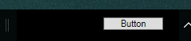

# CS DeskBand - WIP
A Library to create DeskBands on windows using C#. The DeskBands can be created using Winforms or WPF

## Screenshots
  
  
_Images taken from the sample projects_

## Usage

Use `CSDeskBandWin` for winforms or `CSDeskBandWpf` for wpf
- For a winforms usercontrol, inherit the `CSDeskBandWin` base class. _See Sample.Win_
- For a wpf usercontol, Set `CSdeskBandWpf` as the root element in the XAML. _See Sample.Wpf_

Add `[ComVisible(true)]`, `[Guid("xx-xx-xx-xx-xx")]`, `[CSDeskBandRegistration()]` attributes to the class


```C#
using CSDeskBand.Win;
using CSDeskBand;

[ComVisible(true)]
[Guid("5731FC61-8530-404C-86C1-86CCB8738D06")]
[CSDeskBandRegistration(Name = "Sample Winforms Deskband")]
public partial class UserControl1 : CSDeskBandWin
{
...
```

#### Deskband Installation
You need to start an elevated command prompt and be able to use `regasm.exe`
An easy way to do this is use the Developer Command Prompt for Visual Studio. Make sure that you use the correct version of regasm that matches your platform.
```
cd Sample.Win\bin\Debug

regasm /codebase Sample.Win.dll
```

## Examples
There are examples included for Winforms and WPF in Sample.Win and Sample.Wpf